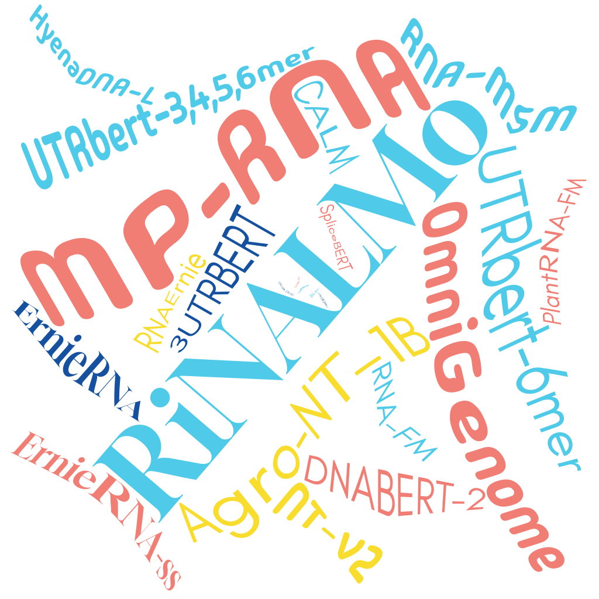

---
hide:
  - navigation
  - toc
  - footer
  - feedback
---
<body class="index">

<!-- Hero Section -->

    

        

            

                OmniGenBench
            

            

            A modular benchmarking platform for evaluating genomic foundation models (gFMs) across diverse tasks like RNA structure prediction, gene function classification, and multi-species generalization.
            

            

                <a href="content/getting-started/basic-introduction" class="md-button md-button--primary">Quick Start</a>
                <a href="#features" class="btn-outline-blue hero-learn-more"> Learn More</a>
            

        

        

            
SCROLL DOWN

            

                
            

        

    

<!-- Features Section -->

    

        

            
Everything you would expect

        

        

            

                

                    
                    

                    <h3>Benchmark effortlessly</h3>
                    
Run automated and reproducible evaluations for genomic foundation models

                    

                

                

                    
                    

                    <h3>Understand your models</h3>
                    
Explore interpretability across diverse tasks and species

                    

                

                

                    
                    

                    <h3>Run tutorials instantly</h3>
                    
Use click-to-run guides for genomic sequence modeling

                    

                

                

                    
                    

                    <h3>Train and infer efficiently </h3>
                    
Accelerated workflows for training and inference on GFMs

                    

                

                

                    
📝

                    

                    <h3>Features </h3>
                    
A brief description of the features of the project.

                    

                

                

                    
📝

                    

                    <h3>Features</h3>
                    
A brief description of the features of the project.

                    

                

            

        

    

<!-- Card Section-->

    

        

            

                <h2 style="font-size: 1.5rem; font-weight: bold;">30+ Genomic Foundation Models Supported</h2>
                
OmniGenBench provides comprehensive support for over 30 state-of-the-art genomic foundation models, including DNABERT, Nucleotide Transformer, DNAGPT, and many more. Our platform enables seamless evaluation across diverse model architectures and training approaches.

                
From transformer-based models to graph neural networks, OmniGenBench supports models designed for DNA sequence analysis, RNA structure prediction, protein function prediction, and multi-species genomic understanding. Each model is carefully integrated with standardized evaluation protocols.

                <a href="content/getting-started/supported-models.md" style="color: #2962ff; text-decoration: none;">→ Learn more</a>
            

            

                
            

        

    

    

        

            

                
            

            

                <h2 style="font-size: 1.5rem; font-weight: bold;">5 Curated Benchmarks Supported</h2>
                
OmniGenBench features five carefully curated benchmarks covering the most important genomic tasks: DNA sequence classification, RNA structure prediction, protein function annotation, regulatory element identification, and cross-species sequence analysis.

                
Each benchmark includes standardized datasets, evaluation metrics, and baseline results, ensuring fair and reproducible comparisons across different genomic foundation models. Our benchmarks are designed to test both general genomic understanding and task-specific capabilities.

                <a href="content/benchmarks/overview.md" style="color: #2962ff; text-decoration: none;">→ Learn more</a>
            

            
        

    

    

        

            

                <h2 style="font-size: 1.5rem; font-weight: bold;">Rich Explanation Methods</h2>
                
OmniGenBench provides comprehensive interpretability tools including attention visualization, saliency mapping, feature attribution, and sequence motif discovery. These methods help researchers understand how genomic foundation models make predictions and identify important biological patterns.

                
Our explanation framework supports multiple visualization techniques, from heatmaps showing attention patterns to interactive sequence browsers that highlight key genomic regions. This enables deeper insights into model behavior and biological relevance of predictions.

                <a href="content/interpretability/overview.md" style="color: #2962ff; text-decoration: none;">→ Learn more</a>
            

            

                
            

        

    

    

        

            

                
            

            

                <h2 style="font-size: 1.5rem; font-weight: bold;">Faster Training with LoRA</h2>
                
OmniGenBench integrates Low-Rank Adaptation (LoRA) techniques to enable efficient fine-tuning of large genomic foundation models. This approach reduces computational requirements by up to 90% while maintaining model performance, making genomic AI accessible to more researchers.

                
Our LoRA implementation supports various adaptation strategies, from task-specific fine-tuning to multi-task learning. This enables rapid experimentation and deployment of genomic models across different biological applications without the need for full model retraining.

                <a href="content/training/lora-guide.md" style="color: #2962ff; text-decoration: none;">→ Learn more</a>
            

        

    

<!-- Team Section -->

  

    

      <h2 style="font-size: 2rem; font-weight: bold;">Meet the Team</h2>
      
The minds behind OmniGenBench

    

    

      <figure class="team-figure">
        
        <figcaption class="team-overlay">
          Ke Li 
          Project Lead
        </figcaption>
      </figure>
      <figure class="team-figure">
        
        <figcaption class="team-overlay">
          Bob Lee 
          Lead Engineer
        </figcaption>
      </figure>
      <figure class="team-figure">
        
        <figcaption class="team-overlay">
          Carol Smith 
          Data Scientist
        </figcaption>
      </figure>
      <figure class="team-figure">
        
        <figcaption class="team-overlay">
          Carol Smith 
          Data Scientist
        </figcaption>
      </figure>
      <figure class="team-figure">
        
        <figcaption class="team-overlay">
          Carol Smith 
          Data Scientist
        </figcaption>
      </figure>
    

  

<!-- Partners Section -->

  

    

      <h2 style="font-size: 2rem; font-weight: bold;">Our Partners</h2>
    

    

      

        
      

      

        
      

      

        
      

    

  

</body>
